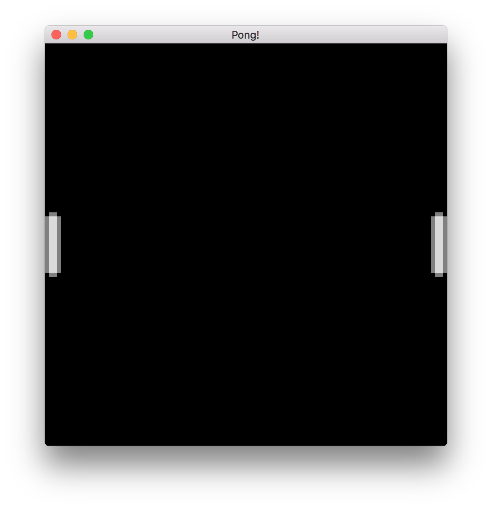

# Отрисовка ракеток

Теперь давайте немного разберёмся с отрисовкой! Чтобы нам что-то нарисовать на экране, нам нужно сперва это что-то нарисовать. В Аметисте эти «нечто» называются сущностями.

Аметист использует платформу Entity-Component-System (ECS), называемую **Specs**, также написанную на Rust. Вы можете узнать больше о Specs в [The Specs Book][the-specs-book]. Вот основное объяснение ECS из документации:

[the-specs-book]: https://specs.amethyst.rs/docs/tutorials/

> Термин ECS - сокращение от Entity-Component-System. Это три основных понятия. Каждая сущность связана с некоторыми компонентами. Эти сущности и компоненты обрабатываются системами. Таким образом, ваши данные (компоненты) полностью отделены от поведения (систем). Сущность просто логически группирует компоненты; поэтому компонент `Velocity` может быть применен к компоненту `Position` той же сущности.

Я рекомендую, всё же, просмотреть The Specs Book, чтобы понять, как работает Amethyst, особенно если вы новичок в ECS.

## Быстрый рефакторинг

Прежде чем добавить больше логики Pong, необходимо отделить код инициализации приложения от кода Pong.

1. В каталоге `src` создайте новый файл с именем `pong.rs` и добавьте следующие операторы use. Это необходимо, чтобы пройти через эту главу:

    ```rust,edition2018,no_run,noplaypen
    # extern crate amethyst;
    #
    use amethyst::{
        assets::{AssetStorage, Loader, Handle},
        core::transform::Transform,
        ecs::prelude::{Component, DenseVecStorage},
        prelude::*,
        renderer::{Camera, ImageFormat, SpriteRender, SpriteSheet, SpriteSheetFormat, Texture},
    };
    ```

2. Переместите структуру `Pong` и блок `impl SimpleState for Pong` из `main.rs` в `pong.rs`.

3. В `main.rs` объявите `pong` как модуль и импортируйте состояние `Pong`:

    ```rust,ignore
    mod pong;

    use crate::pong::Pong;
    ```

## Обойти мир

Во-первых, в `pong.rs` давайте добавим новый метод в нашу реализацию `State`: `on_start`. Этот метод вызывается при запуске `State`. Мы пока оставим это пустым.

```rust,edition2018,no_run,noplaypen
# extern crate amethyst;
# use amethyst::prelude::*;
# struct Pong;
impl SimpleState for Pong {
    fn on_start(&mut self, data: StateData<'_, GameData<'_, '_>>) {

    }
}
```

`StateData<'_, GameData <'_, '_>>` - это структура, предоставляемая всем методам `State`. Важной частью её содержания здесь является её поле `world`. Структура `World` хранит все данные созданные во время выполнения игры - сущности и компоненты.

## Рендеринг игры с помощью камеры

Первое, что нам понадобится в нашей игре, - это `Camera`. Это компонент, который будет определять то, что отображается на экране. Он ведет себя как настоящая камера: он смотрит на конкретную часть мира и может перемещаться по желанию.

1. Определите размер игровой зоны в верхней части `pong.rs`.

    ```rust,edition2018,no_run,noplaypen
    pub const ARENA_HEIGHT: f32 = 100.0;
    pub const ARENA_WIDTH: f32 = 100.0;
    ```

    Они общедоступны, так как будут использоваться в других модулях.

2. Создайте объект камеры.

    В игре понг мы хотим, чтобы камера покрывала всю арену. Давайте сделаем это в новой функции `initialise_camera`:

    ```rust,edition2018,no_run,noplaypen
    # extern crate amethyst;
    #
    # const ARENA_HEIGHT: f32 = 100.0;
    # const ARENA_WIDTH: f32 = 100.0;
    # use amethyst::prelude::*;
    # use amethyst::ecs::World;
    # use amethyst::renderer::Camera;
    # use amethyst::core::Transform;
    fn initialise_camera(world: &mut World) {
        // Настроим камеру таким образом, чтобы наш экран покрывал всю арену и (0, 0) находился внизу слева.
        let mut transform = Transform::default();
        transform.set_translation_xyz(ARENA_WIDTH * 0.5, ARENA_HEIGHT * 0.5, 1.0);

        world
            .create_entity()
            .with(Camera::standard_2d(ARENA_WIDTH, ARENA_HEIGHT))
            .with(transform)
            .build();
    }
    ```

    Это создает объект, который будет нести нашу камеру с ортогональной проекцией размера нашей арены. Мы также прикрепляем компонент `Transform`, представляющий его положение в мире.

    Функция `Camera::standard_2d` создает 2D-камеру по умолчанию, которая направлена ​​вдоль мировой оси **Z**. Область перед камерой имеет горизонтальную ось **X** и вертикальную ось **Y**. Ось **X** увеличивается при движении вправо, а ось **Y** увеличивается при движении вверх. Положение камеры - центр видимой области. Мы помещаем камеру с `set_translation_xyz` в середину игровой арены так, чтобы `(0, 0)` находился внизу слева от видимой области, а `(ARENA_WIDTH, ARENA_HEIGHT)` - вверху справа.

    Обратите внимание, что мы также сместили камеру на `1.0` вдоль оси **Z**. Это сделано для того, чтобы камера могла видеть спрайты, расположенные на плоскости **XY**, где **Z** равно `0,0`:

    

    > **Примечание.** Ортогональные проекции - это тип трехмерной визуализации на двухмерных экранах, в котором соотношение размеров двумерных изображений не изменяется. Они очень полезны в играх без реального 3D, как наш пример с понгом. Перспективные проекции - это еще один способ отображения графики, более полезный в трехмерных сценах.

3. Чтобы завершить настройку камеры, нам нужно вызвать `initialise_camera` из метода `on_start` состояния `Pong`:

    ```rust,edition2018,no_run,noplaypen
    # extern crate amethyst;
    # use amethyst::prelude::*;
    # use amethyst::ecs::World;
    # fn initialise_camera(world: &mut World) { }
    # struct MyState;
    # impl SimpleState for MyState {
    fn on_start(&mut self, data: StateData<'_, GameData<'_, '_>>) {
        let world = data.world;

        initialise_camera(world);
    }
    # }
    ```

    Теперь, когда наша камера настроена, пришло время добавить ракетки.

## Наш первый компонент

Теперь мы создадим компонент `Paddle`, весь следующий код будет добавлен в `pong.rs`.

1. Определите константы для ширины и высоты весла.

    ```rust,edition2018,no_run,noplaypen
    pub const PADDLE_HEIGHT: f32 = 16.0;
    pub const PADDLE_WIDTH: f32 = 4.0;
    ```

2. Определите перечисление `Side` и структуру `Paddle`:

    ```rust,edition2018,no_run,noplaypen
    # pub const PADDLE_HEIGHT: f32 = 16.0;
    # pub const PADDLE_WIDTH: f32 = 4.0;
    #
    #[derive(PartialEq, Eq)]
    pub enum Side {
        Left,
        Right,
    }

    pub struct Paddle {
        pub side: Side,
        pub width: f32,
        pub height: f32,
    }

    impl Paddle {
        fn new(side: Side) -> Paddle {
            Paddle {
                side,
                width: PADDLE_WIDTH,
                height: PADDLE_HEIGHT,
            }
        }
    }
    ```

    Вы можете сказать: "Но это выглядит как обычная структура!". И вы будете правы, специальный соус идет дальше.

3. Реализуйте типаж `Component` для `Paddle`:

    ```rust,edition2018,no_run,noplaypen
    # extern crate amethyst;
    #
    # use amethyst::ecs::{Component, DenseVecStorage};
    #
    # struct Paddle;
    #
    impl Component for Paddle {
       type Storage = DenseVecStorage<Self>;
    }
    ```

    Благодаря реализации `Component` для структуры `Paddle`, теперь она может быть присоединена к объектам в игре.

    При реализации свойства `Component` мы должны указать тип хранилища. Различные типы хранилищ оптимизируют для более быстрого доступа, более низкого использования памяти или баланса между ними. Для получения дополнительной информации о типах хранилищ, ознакомьтесь с [документацией Specs][specs-docs].

    [specs-docs]: https://specs.amethyst.rs/docs/tutorials/05_storages.html#densevecstorage

## Инициализируем некоторые сущности

Теперь, когда у нас есть компонент `Paddle`, давайте определим некоторые объекты `Paddle`, которые включают этот компонент, и добавим их в наш `World`.

Сначала давайте посмотрим на наш импорт:

```rust,edition2018,no_run,noplaypen
# extern crate amethyst;
use amethyst::core::transform::Transform;
```

`Transform` является компонентом Amethyst ECS, который несет информацию о положении и ориентации относительно родителя, если таковой существует.

Хорошо, давайте сделаем несколько сущностей! Мы определим функцию `initialise_paddles`, которая будет создавать объекты левой и правой ракетки и прикрепили к каждому компонент `Transform`, чтобы расположить их в нашем мире. Как мы определили ранее, наш холст от `0.0` до `ARENA_WIDTH` в горизонтальном измерении и от `0.0` до `ARENA_HEIGHT` в вертикальном измерении. Помните, что точка привязки наших сущностей будет находиться в середине изображения, которое мы хотим отобразить поверх них. Это хорошее правило, которому нужно следовать в целом, поскольку оно облегчает такие операции, как вращение.

```rust,edition2018,no_run,noplaypen
# extern crate amethyst;
# use amethyst::prelude::*;
# use amethyst::core::Transform;
# use amethyst::ecs::World;
# enum Side {
#   Left,
#   Right,
# }
# struct Paddle;
# impl amethyst::ecs::Component for Paddle {
#   type Storage = amethyst::ecs::VecStorage<Paddle>;
# }
# impl Paddle {
#   fn new(side: Side) -> Paddle { Paddle }
# }
# const PADDLE_HEIGHT: f32 = 16.0;
# const PADDLE_WIDTH: f32 = 4.0;
# const ARENA_HEIGHT: f32 = 100.0;
# const ARENA_WIDTH: f32 = 100.0;
/// Инициализирует одну ракетку слева, а другую - справа.
fn initialise_paddles(world: &mut World) {
    let mut left_transform = Transform::default();
    let mut right_transform = Transform::default();

    // Правильно располагаем ракетки
    let y = ARENA_HEIGHT / 2.0;
    left_transform.set_translation_xyz(PADDLE_WIDTH * 0.5, y, 0.0);
    right_transform.set_translation_xyz(ARENA_WIDTH - PADDLE_WIDTH * 0.5, y, 0.0);

    // Создаём левую сущность ракетки.
    world
        .create_entity()
        .with(Paddle::new(Side::Left))
        .with(left_transform)
        .build();

    // Создаём правую сущность ракетки.
    world
        .create_entity()
        .with(Paddle::new(Side::Right))
        .with(right_transform)
        .build();
}
```

Это все, что нужно Amethyst, чтобы отслеживать и перемещать ракетки в нашем виртуальном мире, но нам потребуется еще немного поработать, чтобы нарисовать их. В качестве проверки работоспособности давайте удостоверимся, что код для инициализации весла компилируется. Обновите метод `on_start` следующим образом:

```rust,edition2018,no_run,noplaypen
# extern crate amethyst;
# use amethyst::prelude::*;
# use amethyst::ecs::World;
# fn initialise_paddles(world: &mut World) { }
# fn initialise_camera(world: &mut World) { }
# struct MyState;
# impl SimpleState for MyState {
fn on_start(&mut self, data: StateData<'_, GameData<'_, '_>>) {
    let world = data.world;

    initialise_paddles(world);
    initialise_camera(world);
}
# }
```

Давайте запустим нашу игру с пустым экраном!

```text,ignore
Tried to fetch resource of type `MaskedStorage<Paddle>`[^1] from the `World`, but the resource does not exist.

You may ensure the resource exists through one of the following methods:

* Inserting it when the world is created: `world.insert(..)`.
* If the resource implements `Default`, include it in a system's `SystemData`, and ensure the system is registered in the dispatcher.
* If the resource does not implement `Default`, insert in the world during `System::setup`.

[^1]: Full type name: `amethyst::ecs::storage::MaskedStorage<pong::Paddle>`
```

Ой, что не так? Для использования `Component` в `World` должен быть настроен ресурс `Storage<ComponentType>`. Приведенное выше сообщение об ошибке означает, что мы зарегистрировали компонент `Paddle` на сущности, но не настроили хранилище. Мы можем исправить это, добавив следующую строку перед `initialise_paddles(world)` в методе `on_start`:

```rust,edition2018,no_run,noplaypen
# extern crate amethyst;
# use amethyst::ecs::{World, WorldExt};
# struct Paddle;
# impl amethyst::ecs::Component for Paddle {
#   type Storage = amethyst::ecs::VecStorage<Paddle>;
# }
# fn register() {
#   let mut world = World::new();
world.register::<Paddle>();
# }
```

Это довольно неудобно - необходимо вручную зарегистрировать каждый компонент, прежде чем его можно будет использовать. Должен быть лучший способ. **Подсказка:** есть.

Когда мы добавляем системы в наше приложение, любой компонент, который использует `System`, автоматически регистрируется. Тем не менее, поскольку у нас нет `System`, нам приходится вручную регистрировать компонент `Paddle`.

Давайте снова запустим игру.

Amethyst имеет много внутренних систем, которые он использует, чтобы поддерживать работу, которую мы должны внести в контекст `World`. Для простоты они были сгруппированы в «Связки», которые включают связанные системы и ресурсы. Мы можем добавить их в `GameData` нашего приложения, используя метод `with_bundle`, аналогично тому, как вы регистрируете систему. У нас уже есть `RenderBundle`, регистрация другого будет выглядеть аналогично. Вы должны сначала импортировать `TransformBundle`, а затем зарегистрировать его следующим образом:

```rust,edition2018,no_run,noplaypen
# extern crate amethyst;
#
use amethyst::core::transform::TransformBundle;
#
# use amethyst::{
#     prelude::*,
#     utils::application_root_dir,
# };
#
# struct Pong;
# impl SimpleState for Pong { }
#
fn main() -> amethyst::Result<()> {
#   amethyst::start_logger(Default::default());
#
#   let app_root = application_root_dir()?;
#   let display_config_path =
#       app_root.join("examples/pong_tutorial_02/config/display.ron");
#
    // ...
    let game_data = GameDataBuilder::default()
        // ...

        // Добавим связку преобразования, которая обрабатывает позиции отслеживания объектов
        .with_bundle(TransformBundle::new())?;

#   let assets_dir = "/";
#   let mut game = Application::new(assets_dir, Pong, game_data)?;
#   Ok(())
}
```

На этот раз, когда вы запустите игру, вы должны увидеть знакомый черный экран. Ура!

## Отрисовка

Этот раздел, наконец, позволит нам увидеть что-то.

Первое, что нам нужно сделать, это загрузить спрайт-лист, который мы будем использовать для всей нашей графики в игре. Создайте папку с текстурами `texture` в директории ресурсов проекта `assets`. Она будет содержать [спрайт-лист текстуру][spritesheet] `pong_spritesheet.png`, которая нам нужна для визуализации элементов игры. Мы будем выполнять загрузку в новой функции в `pong.rs`, которая называется `load_sprite_sheet`.

Сначала давайте объявим функцию и загрузим данные изображения листа спрайта.

[spritesheet]: https://book-src.amethyst.rs/stable/images/pong_tutorial/pong_spritesheet.png

```rust,edition2018,no_run,noplaypen
# extern crate amethyst;
#
# use amethyst::{
#     assets::{AssetStorage, Loader, Handle},
#     core::transform::Transform,
#     ecs::prelude::{Component, DenseVecStorage},
#     prelude::*,
#     renderer::{
#         camera::{Camera, Projection},
#         formats::texture::ImageFormat,
#         sprite::{SpriteRender, SpriteSheet, SpriteSheetFormat},
#         Texture,
#     },
# };
#
fn load_sprite_sheet(world: &mut World) -> Handle<SpriteSheet> {
    // Load the sprite sheet necessary to render the graphics.
    // The texture is the pixel data
    // `texture_handle` is a cloneable reference to the texture
    let texture_handle = {
        let loader = world.read_resource::<Loader>();
        let texture_storage = world.read_resource::<AssetStorage<Texture>>();
        loader.load(
            "texture/pong_spritesheet.png",
            ImageFormat::default(),
            (),
            &texture_storage,
        )
    };

    //...
#   unimplemented!()
}
```

`Loader` - это загрузчик ресурсов, который определяется как ресурс (не `Entity`, `Component` или `System`, но все еще является частью нашего ECS `World`). Он был создан, когда мы создавали наше приложение в `main.rs`, и он может читать ресурсы, такие как файлы .obj, но также он может загружать (`load`) .png в качестве текстуры (`Texture`), как в нашем случае использования.

> Ресурсы в Specs - это тип данных, которые могут совместно использоваться системами, будучи независимыми от сущностей, в отличие от компонентов, которые привязаны к конкретным сущностям.

`AssetStorage<Texture>` также является ресурсом; это то, куда загрузчик помещает `Texture`, которую он загрузит с нашего спрайт-листа. Чтобы управлять ими, оставаясь быстрым, Amethyst не дает нам прямой доступ к ассетам, которые мы загружаем. Если бы это произошло иначе, нам пришлось бы ждать полной загрузки текстуры, чтобы сделать все остальные вещи, которые мы должны подготовить, что было бы пустой тратой времени! Вместо этого функция загрузки `load` вернет `Handle<Texture>`. Этот дескриптор «указывает» на место, где ассет будет загружен. В терминах Rust это эквивалентно опции с подсчетом ссылок. Это чрезвычайно полезно, особенно потому, что клонирование дескриптора не клонирует ассет в памяти, поэтому многие вещи могут использовать один и тот же ассет одновременно.

Наряду с нашей текстурой спрайт-листа нам нужен файл, описывающий расположение спрайтов на листе. Давайте создадим прямо рядом с ним файл с именем `pong_spritesheet.ron`. Он будет содержать следующее определение листа спрайта:

```text,ignore
List((
    texture_width: 8,
    texture_height: 16,
    sprites: [
        (
            x: 0,
            y: 0,
            width: 4,
            height: 16,
        ),
        (
            x: 4,
            y: 0,
            width: 4,
            height: 4,
        ),
    ],
))
```

> **Примечание.** Обязательно обратите внимание на вид скобок в файле ron. Особенно, если вы привыкли писать файлы в формате JSON или аналогичные, у вас может возникнуть соблазн использовать там фигурные скобки; однако это приведет к очень трудным для отладки ошибкам, тем более что аметист не предупредит вас об этом при компиляции.

Наконец, мы загружаем файл, содержащий положение каждого спрайта на листе.

```rust,edition2018,no_run,noplaypen
# extern crate amethyst;
#
# use amethyst::{
#     assets::{AssetStorage, Handle, Loader},
#     core::transform::Transform,
#     ecs::prelude::{Component, DenseVecStorage},
#     prelude::*,
#     renderer::{
#         camera::{Camera, Projection},
#         formats::texture::ImageFormat,
#         sprite::{SpriteRender, SpriteSheet, SpriteSheetFormat},
#         Texture,
#     },
# };
#
fn load_sprite_sheet(world: &mut World) -> Handle<SpriteSheet> {
#
#   let texture_handle = {
#       let loader = world.read_resource::<Loader>();
#       let texture_storage = world.read_resource::<AssetStorage<Texture>>();
#       loader.load(
#           "texture/pong_spritesheet.png",
#           ImageFormat::default(),
#           (),
#           &texture_storage,
#       )
#   };
#
    // ...

    let loader = world.read_resource::<Loader>();
    let sprite_sheet_store = world.read_resource::<AssetStorage<SpriteSheet>>();
    loader.load(
        "texture/pong_spritesheet.ron", // Here we load the associated ron file
        SpriteSheetFormat(texture_handle),
        (),
        &sprite_sheet_store,
    )
# }
```

Здесь мы должны использовать дескриптор текстуры. `Loader` возьмет файл, содержащий позиции спрайтов и дескриптор текстуры, и создаст красиво упакованную структуру `SpriteSheet`. Именно эту структуру мы будем использовать для рисования чего-либо на экране.

Обратите внимание, что порядок спрайтов, объявленных в файле листа спрайтов, также имеет большое значение, поскольку на спрайты ссылается индекс в векторе. Если вас интересует спрайт с мячом, он существует на изображении, но мы вернемся к нему в следующей части урока.

Все идет нормально. У нас загружен лист спрайтов, теперь нам нужно связать спрайты с ракетками. Мы обновляем функцию `initialise_paddles`, изменяя ее сигнатуру на:

```rust,edition2018,no_run,noplaypen
# extern crate amethyst;
# use amethyst::ecs::World;
# use amethyst::{assets::Handle, renderer::sprite::SpriteSheet};
fn initialise_paddles(world: &mut World, sprite_sheet_handle: Handle<SpriteSheet>)
# { }
```

Внутри `initialise_paddles` мы создаем `SpriteRender` для ракетки. Здесь нам нужен только один, так как единственное различие между двумя ракетками заключается в том, что правая перевернута горизонтально.

```rust,edition2018,no_run,noplaypen
# extern crate amethyst;
# use amethyst::ecs::World;
# use amethyst::{assets::Handle, renderer::{SpriteRender, SpriteSheet}};
# fn initialise_paddles(world: &mut World, sprite_sheet_handle: Handle<SpriteSheet>) {
// Назначаем спрайты для ракеток
let sprite_render = SpriteRender {
    sprite_sheet: sprite_sheet_handle,
    sprite_number: 0, // ракетка это первый спрайт в sprite_sheet
};
# }
```

`SpriteRender` - это `Component`, который указывает, какой спрайт какого листа спрайта должен быть нарисован для конкретной сущности. Поскольку ракетка является первым спрайтом в листе спрайтов, мы используем `0` для `sprite_number`.

Далее мы просто добавляем компоненты к объектам весла:

```rust,edition2018,no_run,noplaypen
# extern crate amethyst;
# use amethyst::ecs::World;
# use amethyst::assets::Handle;
# use amethyst::renderer::sprite::{SpriteSheet, SpriteRender};
# use amethyst::prelude::*;
# fn initialise_paddles(world: &mut World, sprite_sheet_handle: Handle<SpriteSheet>) {
# let sprite_render = SpriteRender {
#   sprite_sheet: sprite_sheet_handle,
#   sprite_number: 0, // paddle is the first sprite in the sprite_sheet
# };
// Создаём левую сущность ракетки.
world
    .create_entity()
    .with(sprite_render.clone())
    // ... другие компоненты
    .build();

// Создаём правую сущность ракетки.
world
    .create_entity()
    .with(sprite_render)
    // ... другие компоненты
    .build();
# }
```

Почти готово, нам просто нужно подключить спрайт к ракеткам. Мы собираем все это вместе в методе `on_start()`:

```rust,edition2018,no_run,noplaypen
# extern crate amethyst;
# use amethyst::assets::Handle;
# use amethyst::prelude::*;
# use amethyst::renderer::{sprite::SpriteSheet, Texture};
# use amethyst::ecs::World;
# struct Paddle;
# impl amethyst::ecs::Component for Paddle {
#   type Storage = amethyst::ecs::VecStorage<Paddle>;
# }
# fn initialise_paddles(world: &mut World, spritesheet: Handle<SpriteSheet>) { }
# fn initialise_camera(world: &mut World) { }
# fn load_sprite_sheet(world: &mut World) -> Handle<SpriteSheet> { unimplemented!() }
# struct MyState;
# impl SimpleState for MyState {
fn on_start(&mut self, data: StateData<'_, GameData<'_, '_>>) {
    let world = data.world;

    // Загружаем спрайт-лист, необходимый для визуализации графики.
    let sprite_sheet_handle = load_sprite_sheet(world);

    world.register::<Paddle>();

    initialise_paddles(world, sprite_sheet_handle);
    initialise_camera(world);
}
# }
```

И мы сделали это. Давайте запустим нашу игру и повеселимся!

Если все хорошо, мы должны получить что-то похожее на это:



В следующей главе мы рассмотрим «S» в ECS и приведем эти ракетки в движение!

---

Документация была переведена специально для сообщества "**rust_lang_ru**".

Подпишись на нас в **[Telegram][telegram]** и **[YouTube][youtube]**!

[telegram]: http://tlinks.run/rust_lang_ru
[youtube]: https://www.youtube.com/channel/UCu413rnSfuSSOR3OsIThlZA
