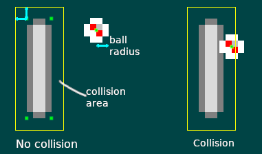

# Отрисовка и перемещение мяча

В предыдущей главе мы узнали, как захватывать пользовательский ввод, чтобы заставить вещи двигаться на экране, при помощи систем. В этой главе будут использованы все знания, полученные нами в предыдущих главах, чтобы добавить в нашу игру новый объект: шар, который движется и подпрыгивает!

Во-первых, давайте определим некоторые другие полезные константы для этой главы в pong.rs:

```rust,edition2018,no_run,noplaypen
pub const BALL_VELOCITY_X: f32 = 75.0;
pub const BALL_VELOCITY_Y: f32 = 50.0;
pub const BALL_RADIUS: f32 = 2.0;
```

Это также можно сделать с помощью внешнего файла конфигурации. Это особенно полезно, когда вы хотите много редактировать значения. Здесь мы делаем это просто.

## Компонент Ball

В `pong.rs` давайте создадим компонент `Ball`.

```rust,edition2018,no_run,noplaypen
# extern crate amethyst;
# use amethyst::ecs::prelude::{Component, DenseVecStorage};
pub struct Ball {
    pub velocity: [f32; 2],
    pub radius: f32,
}

impl Component for Ball {
    type Storage = DenseVecStorage<Self>;
}
```

Мяч имеет скорость и радиус, поэтому мы храним эту информацию в компоненте.

Затем давайте добавим функцию `initialise_ball` так же, как мы написали функцию `initialise_paddles`.


```rust,edition2018,no_run,noplaypen
# extern crate amethyst;
# use amethyst::prelude::*;
# use amethyst::assets::{Loader, AssetStorage, Handle};
# use amethyst::renderer::{Texture, SpriteRender, Sprite, SpriteSheet};
# use amethyst::ecs::World;
# use amethyst::core::transform::Transform;
# use amethyst::ecs::prelude::{Component, DenseVecStorage};
# pub struct Ball {
#    pub velocity: [f32; 2],
#    pub radius: f32,
# }
# impl Component for Ball {
#    type Storage = DenseVecStorage<Self>;
# }
# const PADDLE_HEIGHT: f32 = 16.0;
# const PADDLE_WIDTH: f32 = 4.0;
# const SPRITESHEET_SIZE: (f32, f32) = (8.0, 16.0);
# const BALL_RADIUS: f32 = 2.0;
# const BALL_VELOCITY_X: f32 = 75.0;
# const BALL_VELOCITY_Y: f32 = 50.0;
# const ARENA_HEIGHT: f32 = 100.0;
# const ARENA_WIDTH: f32 = 100.0;
/// Инициализируем один мяч в середине арены
fn initialise_ball(world: &mut World, sprite_sheet_handle: Handle<SpriteSheet>) {
    // Перемещаем.
    let mut local_transform = Transform::default();
    local_transform.set_translation_xyz(ARENA_WIDTH / 2.0, ARENA_HEIGHT / 2.0, 0.0);

    // Назначаем спрайт для мяча
    let sprite_render = SpriteRender {
        sprite_sheet: sprite_sheet_handle,
        sprite_number: 1, // Мяч идёт вторым спрайтом на спрайт-листе
    };

    world
        .create_entity()
        .with(sprite_render)
        .with(Ball {
            radius: BALL_RADIUS,
            velocity: [BALL_VELOCITY_X, BALL_VELOCITY_Y],
        })
        .with(local_transform)
        .build();
}
```
В [предыдущей главе][chapter_4_part_2-drawing] мы видели, как загрузить спрайт-лист и получить их отображение на экране. Запомните информация спрайт-листа хранится в `pong_spritesheet.ron`, а спрайт шара был второй, с индексом `1`.

[chapter_4_part_2-drawing]:chapter_4_part_2.html#Отрисовка

Наконец, давайте удостоверимся, что код работает так, как задумано, обновив метод `on_start`:

```rust,edition2018,no_run,noplaypen
# extern crate amethyst;
# use amethyst::prelude::*;
# use amethyst::assets::Handle;
# use amethyst::renderer::{Texture, SpriteSheet};
# use amethyst::ecs::World;
# struct Paddle;
# impl amethyst::ecs::Component for Paddle {
#   type Storage = amethyst::ecs::VecStorage<Self>;
# }
# struct Ball;
# impl amethyst::ecs::Component for Ball {
#   type Storage = amethyst::ecs::VecStorage<Self>;
# }
# fn initialise_ball(world: &mut World, sprite_sheet_handle: Handle<SpriteSheet>) { }
# fn initialise_paddles(world: &mut World, spritesheet: Handle<SpriteSheet>) { }
# fn initialise_camera(world: &mut World) { }
# fn load_sprite_sheet(world: &mut World) -> Handle<SpriteSheet> { unimplemented!() }
# struct MyState;
# impl SimpleState for MyState {
fn on_start(&mut self, data: StateData<'_, GameData<'_, '_>>) {
    let world = data.world;

    // Загрузка спрайт-листа необходима для отображения графики
    let sprite_sheet_handle = load_sprite_sheet(world);

    world.register::<Ball>(); // <- Временно добавим эту строку

    initialise_ball(world, sprite_sheet_handle.clone()); // <- Добавим эту строку
    initialise_paddles(world, sprite_sheet_handle);
    initialise_camera(world);
}
# }
```

Не забудьте вызвать `clone` для` sprite_sheet_handle`, потому что `initialise_paddles` и `initialise_ball` *потребляет* дескриптор.

Запустив игру сейчас, вы сможете увидеть два весла и мяч в центре. В следующем разделе мы собираемся заставить этот шар двигаться!

## Перемещение мяча

Теперь мы готовы реализовать `MoveBallsSystem` в` systems/move_balls.rs`:

```rust,edition2018,no_run,noplaypen
# extern crate amethyst;
# use amethyst::ecs::prelude::{Component, DenseVecStorage};
#
# mod pong {
#     use amethyst::ecs::prelude::*;
#
#     pub struct Ball {
#        pub velocity: [f32; 2],
#        pub radius: f32,
#     }
#     impl Component for Ball {
#        type Storage = DenseVecStorage<Self>;
#     }
# }
#
use amethyst::{
    core::timing::Time,
    core::transform::Transform,
    core::SystemDesc,
    derive::SystemDesc,
    ecs::prelude::{Join, Read, ReadStorage, System, SystemData, World, WriteStorage},
};

use crate::pong::Ball;

#[derive(SystemDesc)]
pub struct MoveBallsSystem;

impl<'s> System<'s> for MoveBallsSystem {
    type SystemData = (
        ReadStorage<'s, Ball>,
        WriteStorage<'s, Transform>,
        Read<'s, Time>,
    );

    fn run(&mut self, (balls, mut locals, time): Self::SystemData) {
        // Перемещаем каждый шар в соответствии с его скоростью и прошедшим временем
        for (ball, local) in (&balls, &mut locals).join() {
            local.prepend_translation_x(ball.velocity[0] * time.delta_seconds());
            local.prepend_translation_y(ball.velocity[1] * time.delta_seconds());
        }
    }
}
#
# fn main() {}
```
Эта система отвечает за перемещение всех мячей в соответствии с их скоростью и прошедшим временем. Обратите внимание, как метод `join()` используется для итерации по всем сущностям мячей. Здесь у нас есть только один мяч, но если нам когда-либо понадобится несколько, система будет обрабатывать и другие. В этой системе мы также хотим *независимость от частоты кадров*. То есть, независимо от частоты кадров, все объекты движутся с одинаковой скоростью. Для этого используется **дельта времени**, которое является продолжительностью с момента последнего кадра. Это обычно известно как ["delta timing"] [delta-timing]. Как видно из фрагмента, чтобы получить доступ к времени, прошедшему с момента последнего кадра, вам нужно использовать ресурс [`amethyst::core::timing::Time`][time]. У него есть метод, называемый `delta_seconds`, который делает именно то, что нам нужно.

[delta-timing]: https://en.wikipedia.org/wiki/Delta_timing
[time]: https://docs.amethyst.rs/stable/amethyst_core/timing/struct.Time.html

Теперь, когда наш мяч может двигаться, давайте внедрим новую систему: `BounceSystem` в `systems/bounce.rs`. Он будет отвечать за обнаружение столкновений между шарами и ракетками, а также шарами и верхним и нижним краем арены. При обнаружении столкновения мяч отскакивает. Это делается с помощью изменения скорости компонента `Ball` оси `x` или `y` на отрицательную.

```rust,edition2018,no_run,noplaypen
# extern crate amethyst;
# use amethyst::ecs::prelude::{Component, DenseVecStorage};
#
# mod pong {
#     use amethyst::ecs::prelude::*;
#
#     pub struct Ball {
#        pub velocity: [f32; 2],
#        pub radius: f32,
#     }
#     impl Component for Ball {
#        type Storage = DenseVecStorage<Self>;
#     }
#
#     #[derive(PartialEq, Eq)]
#     pub enum Side {
#       Left,
#       Right,
#     }
#
#     pub struct Paddle {
#       pub side: Side,
#       pub width: f32,
#       pub height: f32,
#     }
#     impl Component for Paddle {
#       type Storage = VecStorage<Self>;
#     }
#
#     pub const ARENA_HEIGHT: f32 = 100.0;
# }
#
use amethyst::{
    core::{Transform, SystemDesc},
    derive::SystemDesc,
    ecs::prelude::{Join, ReadStorage, System, SystemData, World, WriteStorage},
};

use crate::pong::{Ball, Side, Paddle, ARENA_HEIGHT};

# #[derive(SystemDesc)]
pub struct BounceSystem;

impl<'s> System<'s> for BounceSystem {
    type SystemData = (
        WriteStorage<'s, Ball>,
        ReadStorage<'s, Paddle>,
        ReadStorage<'s, Transform>,
    );

    fn run(&mut self, (mut balls, paddles, transforms): Self::SystemData) {
        // Проверяем, не столкнулся ли мяч, и отскакиваем соответственно.
        //
        // Мы также проверяем скорость мяча каждый раз, чтобы предотвратить множественные столкновения
        for (ball, transform) in (&mut balls, &transforms).join() {
            let ball_x = transform.translation().x;
            let ball_y = transform.translation().y;

            // Отскакивание от вершины или нижней части арены.
            if (ball_y <= ball.radius && ball.velocity[1] < 0.0)
                || (ball_y >= ARENA_HEIGHT - ball.radius && ball.velocity[1] > 0.0)
            {
                ball.velocity[1] = -ball.velocity[1];
            }

            // Отскакивание от ракетки
            for (paddle, paddle_transform) in (&paddles, &transforms).join() {
                let paddle_x = paddle_transform.translation().x - (paddle.width * 0.5);
                let paddle_y = paddle_transform.translation().y - (paddle.height * 0.5);

                // Чтобы определить столкнулся ли мяч с ракеткой, мы создаём больший
                // прямоугольник вокруг текущего, вычитая радиус мяча из
                // нижних координат, и добавляя радиус мяча к верхним.
                // Мяч находиться внутри ракетки, когда его центр находится внутри большего
                // прямоугольника-обёртки.
                if point_in_rect(
                    ball_x,
                    ball_y,
                    paddle_x - ball.radius,
                    paddle_y - ball.radius,
                    paddle_x + paddle.width + ball.radius,
                    paddle_y + paddle.height + ball.radius,
                ) {
                    if (paddle.side == Side::Left && ball.velocity[0] < 0.0)
                        || (paddle.side == Side::Right && ball.velocity[0] > 0.0)
                    {
                        ball.velocity[0] = -ball.velocity[0];
                    }
                }
            }
        }
    }
}

// Точка находится в прямоугольнике когда её координаты
// меньше или равны правому верхнему углу и больше или равны левому нижнему углу.
fn point_in_rect(x: f32, y: f32, left: f32, bottom: f32, right: f32, top: f32) -> bool {
    x >= left && x <= right && y >= bottom && y <= top
}
#
# fn main() {}
```

На следующем рисунке показано, как проверяются столкновения с ракетками.



Также не забудьте добавить `mod move_balls` и `mod bounce` в `systems/mod.rs` а также добавление наших новых систем к игровым данным:

```rust,edition2018,no_run,noplaypen
# extern crate amethyst;
# use amethyst::prelude::*;
# use amethyst::core::transform::TransformBundle;
# use amethyst::window::DisplayConfig;
# use amethyst::input::StringBindings;
# fn main() -> amethyst::Result<()> {
# let path = "./config/display.ron";
# let config = DisplayConfig::load(&path)?;
# mod systems {
# use amethyst;
# use amethyst::core::ecs::{System, SystemData, World};
# use amethyst::core::SystemDesc;
# use amethyst::derive::SystemDesc;
# #[derive(SystemDesc)]
# pub struct PaddleSystem;
# impl<'a> amethyst::ecs::System<'a> for PaddleSystem {
# type SystemData = ();
# fn run(&mut self, _: Self::SystemData) { }
# }
# #[derive(SystemDesc)]
# pub struct MoveBallsSystem;
# impl<'a> amethyst::ecs::System<'a> for MoveBallsSystem {
# type SystemData = ();
# fn run(&mut self, _: Self::SystemData) { }
# }
# #[derive(SystemDesc)]
# pub struct BounceSystem;
# impl<'a> amethyst::ecs::System<'a> for BounceSystem {
# type SystemData = ();
# fn run(&mut self, _: Self::SystemData) { }
# }
# }
# let input_bundle = amethyst::input::InputBundle::<StringBindings>::new();
let game_data = GameDataBuilder::default()
#    .with_bundle(TransformBundle::new())?
#    .with_bundle(input_bundle)?
#    .with(systems::PaddleSystem, "paddle_system", &["input_system"])
    // ...другие системы...
    .with(systems::MoveBallsSystem, "ball_system", &[])
    .with(
        systems::BounceSystem,
        "collision_system",
        &["paddle_system", "ball_system"],
    );
# let assets_dir = "/";
# struct Pong;
# impl SimpleState for Pong { }
# let mut game = Application::new(assets_dir, Pong, game_data)?;
# Ok(())
# }
```

Теперь у вас должен быть мяч, движущийся и отскакивающий от ракетки и от верхней и нижней части экрана. Тем не менее, вы быстро заметите, что если мяч выходит за пределы экрана справа или слева, он никогда не возвращается и игра окончена. Вы можете даже не увидеть этого, так как мяч может быть уже за пределами экрана, когда появляется окно. Возможно, вам придется резко сократить `BALL_VELOCITY_X`, чтобы увидеть это в действии. Это, очевидно, не очень хорошее решение для реальной игры. Чтобы решить эту проблему и лучше увидеть, что происходит, мы должны порождать мяч с небольшой задержкой.

## Создаём мяч с задержкой

Мяч теперь появляется и исчезает с экрана сразу после начала игры. Это может дезориентировать, так как вас бросают в игру и вы сразу теряете свое первое очко, прежде чем у вас было время, чтобы что то заметить. Нам также нужно дать время для операционной системы и средства визуализации для инициализации окна до начала игры. Обычно у вас есть отдельное состояние с игровым меню, так что это не проблема. Но наша игра бросает вас прямо в действие, поэтому мы должны решить эту проблему.

Давайте сделаем задержку до первого появления мяча. Это также хорошая возможность использовать структуру нашего игрового состояния для содержания некоторых данных.

Во-первых, давайте добавим новый метод в наше состояние: `update`. Давайте добавим метод `update` чуть ниже метода `on_start`:

```rust,edition2018,no_run,noplaypen
# extern crate amethyst;
# use amethyst::prelude::*;
# struct MyState;
# impl SimpleState for MyState {
fn update(&mut self, data: &mut StateData<'_, GameData<'_, '_>>) -> SimpleTrans {
    Trans::None
}
# }
```

Этот метод позволяет вам переходить из состояния, используя его возвращаемое значение. Здесь мы не хотим изменять никакое состояние, поэтому мы возвращаем `Trans::None`.

Теперь нам нужно перенести создание ракетки в этот метод и добавить к нему некоторую задержку. Наш `update` запускает каждый кадр, таким образом, чтобы сделать что-то только один раз после определенного времени, мы должны использовать наше локальное состояние. Кроме того, обратите внимание, что для «initialise_paddles» требуется, чтобы мы предоставили «sprite_sheet_handle», но он был создан как локальная переменная внутри `on_start`. По этой причине мы должны сделать его частью состояния.

Давайте добавим несколько полей в нашу структуру `Pong`:

```rust,edition2018,no_run,noplaypen
# extern crate amethyst; use amethyst::renderer::SpriteSheet;
# use amethyst::assets::Handle;
#[derive(Default)]
pub struct Pong {
    ball_spawn_timer: Option<f32>,
    sprite_sheet_handle: Option<Handle<SpriteSheet>>,
}
```

Наш таймер представлен параметром `Option <f32>`, который будет отсчитываться до нуля, когда доступен, и будет заменен на `None` после того как пройдёт время. Наш дескриптор спрайт-листа также находится внутри `Option`, потому что мы не можем создать его внутри конструктора `Pong`. Вместо этого он будет создан внутри метода `on_start`.

Мы также добавили `#[derive(Default)]`, который автоматически реализует для нас черту `Default`, которая позволяет создавать пустое состояние по умолчанию. Теперь давайте используем это в нашем коде создания `Application` в` main.rs`:

```rust,edition2018,no_run,noplaypen
# extern crate amethyst;
# use amethyst::{
#     ecs::{World, WorldExt},
#     prelude::*,
# };
#
# #[derive(Default)] struct Pong;
# impl SimpleState for Pong { }
# fn main() -> amethyst::Result<()> {
#   let game_data = GameDataBuilder::default();
#   let assets_dir = "/";
#   let world = World::new();
let mut game = Application::new(assets_dir, Pong::default(), game_data)?;
#   Ok(())
# }
```

Теперь давайте закончим наш код созданием таймера и мяча. Мы должны сделать две вещи:
- Сначала мы должны инициализировать наше состояние и удалить `initialise_ball` из` on_start`;
- После мы должны инициализировать мяч функцией `initialise_ball` один раз по истечении времени внутри` update`.

```rust,edition2018,no_run,noplaypen
# extern crate amethyst;
# use amethyst::{assets::Handle, renderer::SpriteSheet};
# use amethyst::prelude::*;
use amethyst::core::timing::Time;

# struct Paddle;
# impl amethyst::ecs::Component for Paddle {
#   type Storage = amethyst::ecs::VecStorage<Self>;
# }
# struct Ball;
# impl amethyst::ecs::Component for Ball {
#   type Storage = amethyst::ecs::VecStorage<Self>;
# }
# fn initialise_ball(world: &mut World, sprite_sheet_handle: Handle<SpriteSheet>) { }
# fn initialise_paddles(world: &mut World, spritesheet: Handle<SpriteSheet>) { }
# fn initialise_camera(world: &mut World) { }
# fn load_sprite_sheet(world: &mut World) -> Handle<SpriteSheet> { unimplemented!() }
# #[derive(Default)] pub struct Pong {
#     ball_spawn_timer: Option<f32>,
#     sprite_sheet_handle: Option<Handle<SpriteSheet>>,
# }
#
impl SimpleState for Pong {
    fn on_start(&mut self, data: StateData<'_, GameData<'_, '_>>) {
        let world = data.world;

        // Ждём одну секунду, прежде чем создать мяч.
        self.ball_spawn_timer.replace(1.0);

        // Загрузка спрайт-листа, необходимого для визуализации графики.
        // `spritesheet` это расположение спрайтов на изображении;
        // `texture` это данные пикселей.
        self.sprite_sheet_handle.replace(load_sprite_sheet(world));
        initialise_paddles(world, self.sprite_sheet_handle.clone().unwrap());
        initialise_camera(world);
    }

    fn update(&mut self, data: &mut StateData<'_, GameData<'_, '_>>) -> SimpleTrans {
        if let Some(mut timer) = self.ball_spawn_timer.take() {
            // Если время таймера еще не истекло, вычтите время, прошедшее с момента последнего обновления.
            {
                let time = data.world.fetch::<Time>();
                timer -= time.delta_seconds();
            }
            if timer <= 0.0 {
                // Когда таймер истекает, появляется мяч
                initialise_ball(data.world, self.sprite_sheet_handle.clone().unwrap());
            } else {
                // Если время таймера еще не истекло, возвращаем его в состояние.
                self.ball_spawn_timer.replace(timer);
            }
        }
        Trans::None
    }
}
```

Теперь наш мяч появится только после заданной задержки, что даст нам немного времени перед запуском. Это позволит нам увидеть, что происходит с мячом сразу после его появления.

## Подведём итог

В этой главе мы наконец добавили мяч в нашу игру. Как всегда, полный код доступен в репозитории Amethyst. В следующей главе мы добавим проверку системой, когда игрок проигрывает игру, и добавим систему начисления очков!

---

Документация была переведена специально для сообщества "**rust_lang_ru**".

Подпишись на нас в **[Telegram][telegram]** и **[YouTube][youtube]**!

[telegram]: http://tlinks.run/rust_lang_ru
[youtube]: https://www.youtube.com/channel/UCu413rnSfuSSOR3OsIThlZA
